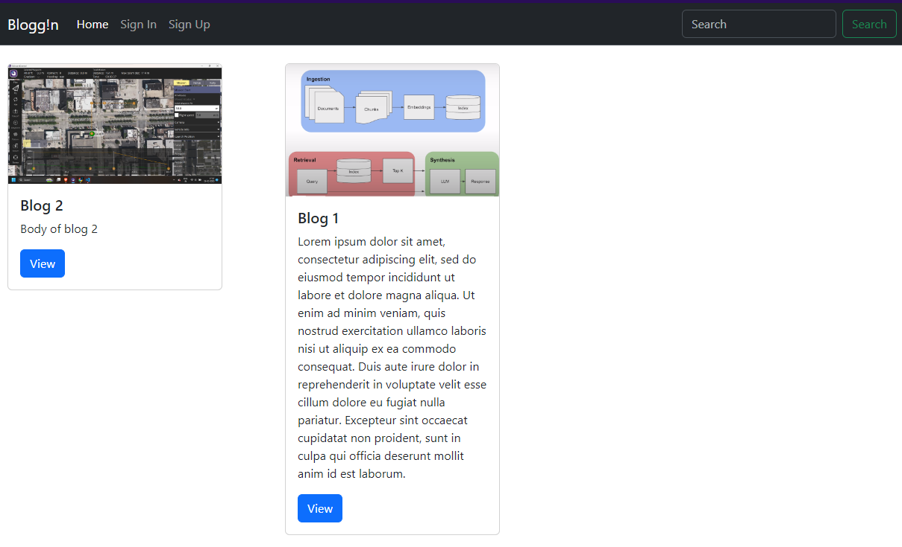
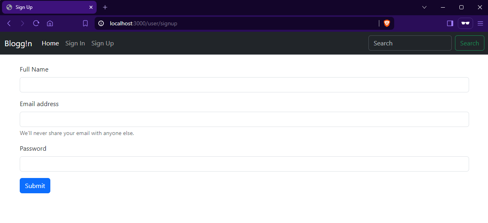
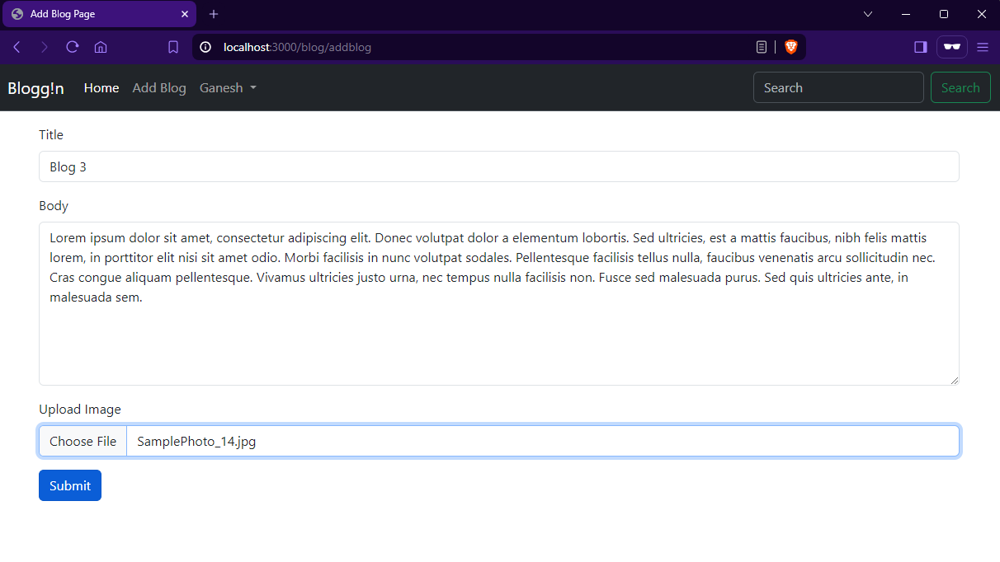
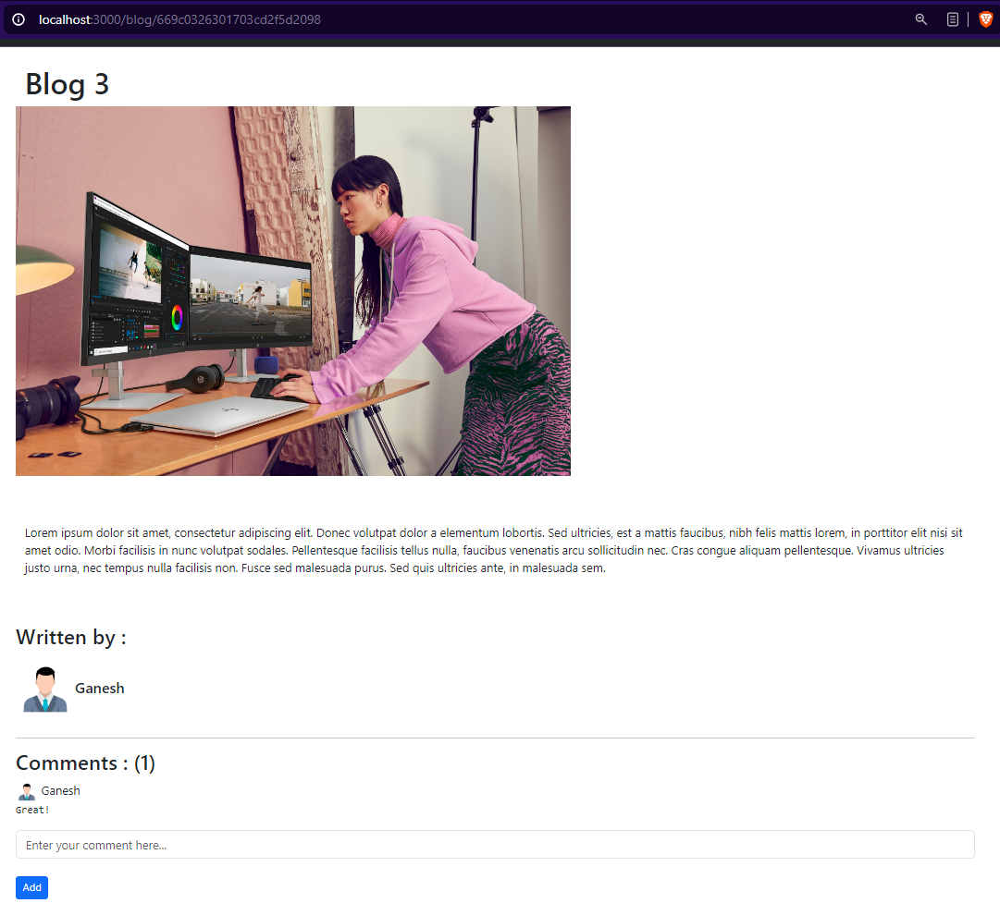

# Blogg!n

A full-featured blog application built with Node.js, Express.js, and EJS, using MongoDB Atlas for data storage. The application includes user authentication, blog creation, viewing, and commenting functionalities.

## Features

- User authentication using JWT
- Password encryption with SHA-256
- Blog creation, editing, and deletion
- Viewing all blogs and individual blog details
- Adding comments to blogs
- Image upload using Multer

## Demo

### Overview


### Sign Up


### Add Blog


### View Blog


## Technologies Used

- Node.js
- Express.js
- EJS
- MongoDB Atlas
- Multer
- JSON Web Tokens (JWT)
- SHA-256 for password encryption

## Installation

1. **Clone the repository:**

    ```bash
    git clone https://github.com/yourusername/blog-app.git
    cd blog-app
    ```

2. **Install dependencies:**

    ```bash
    npm install
    ```

3. **Create a `.env` file in the root directory and add the following variables:**

    ```env
    PORT=3000
    MONGODB_URI=your_mongodb_atlas_uri
    ```

4. **Run the application:**

    ```bash
    npm start
    ```

5. **Visit the application in your browser:**

    ```bash
    http://localhost:3000
    ```


